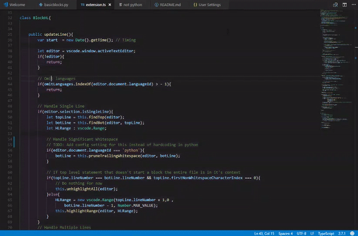
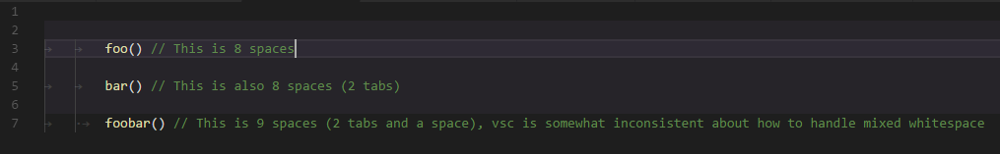

# indented-block-highlighting README

Highlights the intented area that contains the cursor.

## Features

Highlight the selected block automatically like so:

## Extension Settings

This extension contributes the following settings:

* `blockhighlight.background`: Change the highlight color
* `blockhighlight.omit`: Array of languages that will not be parsed by this extension
* `blockhighlight.isWholeLine`: Option to highlight the entire line or only the text
* `blockhighlight.accentCurrentLine`: Option to choose to accent the current line more intensely than the rest of the block

## Known Issues

**Improper indentation levels for lines with mixed whitespace:**

Indenting the **same** line with a mixture of tabs and spaces causes improper behavior because of how VSC autoadjusts whitespace

Example of issue:

This extension does not parse syntax, it simply checks indentation levels.

Unindented text is not highlighted; This is intentional.

## Release Notes

### 1.0.7

Removed package-lock.json

### 1.0.6

Require Hoek 5.0.3

### 1.0.5

Accent Current Line feature added.

### 1.0.3

Tabs size is now pulled in from each document.

### ~~1.0.1.1~~ 1.0.2

Fixed tabs being considered as 1 space

### 1.0.1

Added Whole Lines

### 1.0.0

Release + Bug fixing